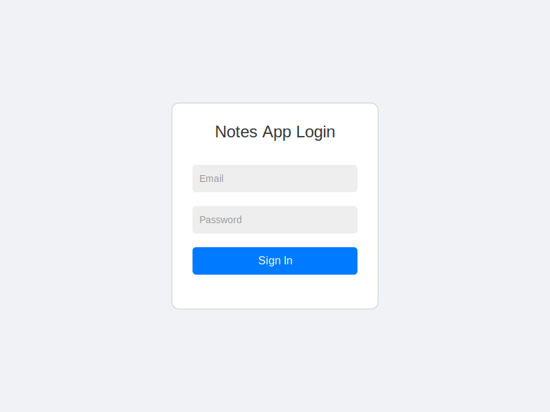
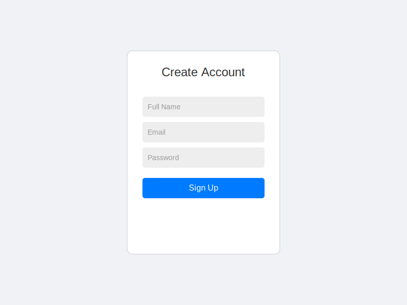

# Notes App

A full-stack notes application built with Spring Boot and React.

## 🚀 Features

- **User Authentication**: Secure login and registration using JWT.
- **Create & Manage Notes**: Create, edit, and delete notes easily.
- **Search Functionality**: Quickly find notes by title or content.
- **Responsive Design**: Optimized for desktop and mobile devices.
- **Modern UI**: Built with React, Vite, and Tailwind CSS.
- **Database Integration**: Persistent storage with PostgreSQL.

## 🛠️ Tech Stack

- **Backend**: Java 25, Spring Boot 3, Spring Security, JPA/Hibernate
- **Frontend**: React 18, Vite, Tailwind CSS
- **Database**: PostgreSQL 15
- **Containerization**: Docker & Docker Compose

## 📸 Screenshots

| Login | Register | Dashboard |
|:---:|:---:|:---:|
|  |  |  |

## 🐳 Run with Docker (Recommended)

The easiest way to run the application is using Docker Compose.

1.  **Clone the repository** (if you haven't already).
2.  **Run the application**:
    ```bash
    docker-compose up --build
    ```
3.  **Access the app**:
    - Frontend: `http://localhost:5173`
    - Backend API: `http://localhost:8080`

## 🔧 Manual Setup

If you prefer to run the services locally without Docker:

### Backend

1.  **Prerequisites**: Java 25 installed.
2.  **Navigate to backend**:
    ```bash
    cd backend
    ```
3.  **Build**:
    ```bash
    ./mvnw clean package -DskipTests
    ```
4.  **Run**:
    ```bash
    java -jar target/notesapp-0.0.1-SNAPSHOT.jar
    ```
    The backend will start on port `8080`.

### Frontend

1.  **Prerequisites**: Node.js & npm installed.
2.  **Navigate to frontend**:
    ```bash
    cd frontend
    ```
3.  **Install dependencies**:
    ```bash
    npm install
    ```
4.  **Run development server**:
    ```bash
    npm run dev
    ```
    The frontend will start on `http://localhost:5173`.
    *Note: The `vite.config.js` is configured to proxy API requests to `localhost:8080`.*
